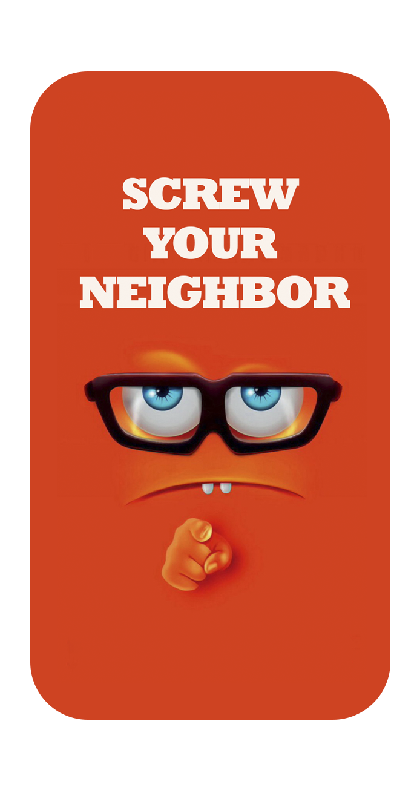

<h1 align="center">
   
</h1>

# Screw your neighbor: backend solution [^1]

[^1]: By group 36 of the course "Software Praktikum"@UZH in FS 22.

## Contributors
Screw your neighbor application was developed in context of the SoPra (Software Praktikum / Software Engineerin Lab)
module at the _Institut für Informatik_ at the University of Zurich by Lucius Bachmann, Beat Furrer, Carmen Kirchdorfer, Moris Camporesi
and Salome Wildermuth.

Any new contributor hearts, welcome to our Screw-your-neighbor-family. Please don't hesitate to open a PR or an issue if there's
something that needs improvement or if you want to help implementing one of our roadmap features!

## License

This project is licensed under the **MIT license**.

See [LICENSE](LICENSE.txt) for more information.
