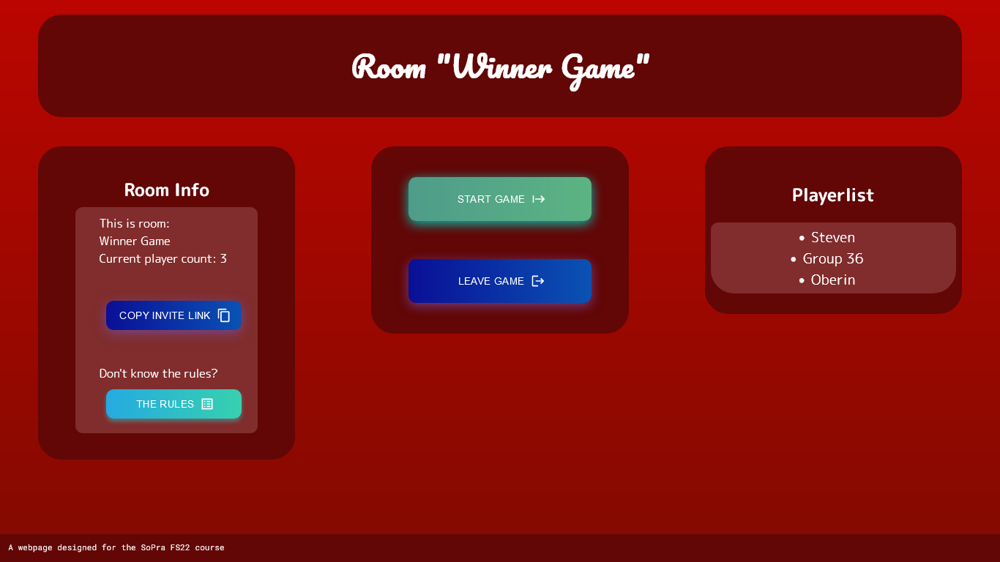
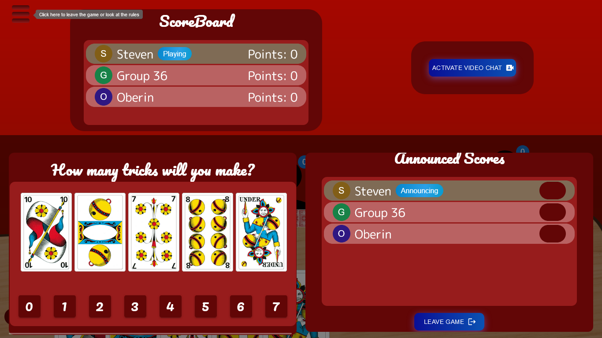
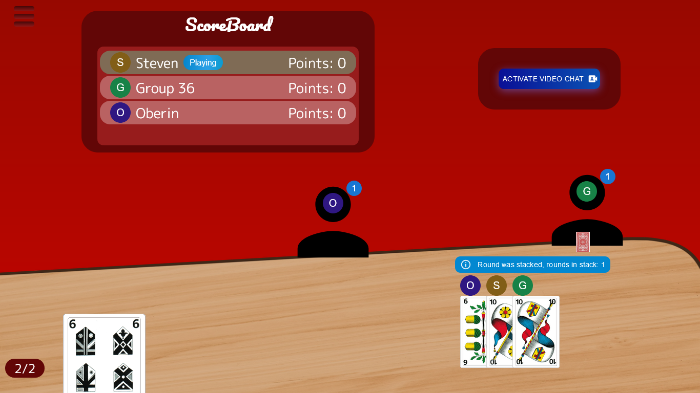
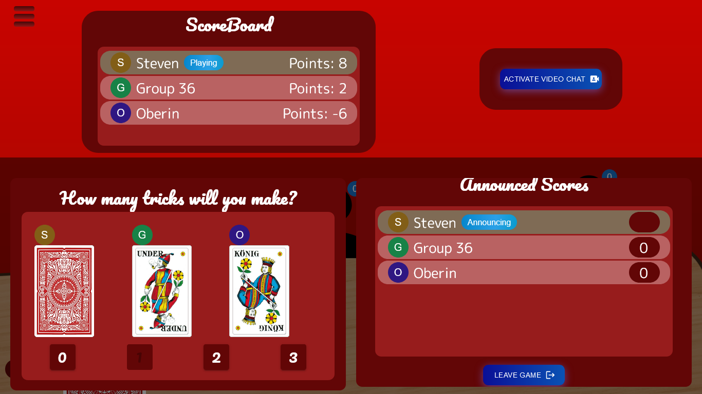
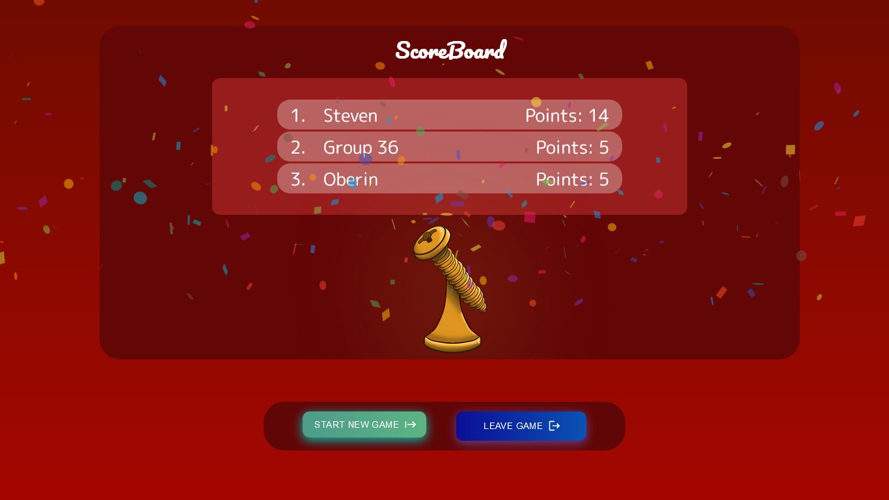

\centering

# SCREW YOUR NEIGHBOR

Report for Milestone 3 of Sopra FS22, Group 36

**Members**

Carmen Kirchdorfer (20-720-132)  
Salome Wildermuth (10-289-544)  
Beat Furrer, group leader (07-542-392)  
Lucius Bachmann (11-060-274)  
Moris Camporesi (19-764-349)

\newpage
\raggedright
## 1.  Introduction to the game

### 1.1 The rule set
Our game can be played by two up to five people. The goal for every player is to gain as 
many points as possible during the game. Every player plays for himself, 
there are no teams. The game is played with a “Swiss Jass” card set of 36 cards with four suits.

The game is divided into 9 matches with changing number of distributed cards per player 
(5,4,3,2,1,2,3,4,5), and for every match points are distributed.

For the first match, every player gets 5 cards. 
Then one player after the other must announce how many tricks ("Stich", according to https://en.wikipedia.org/wiki/Jass) 
they will make in this match, 
starting from the player to the right from the current dealer. 
The last one announcing the number of his tricks for this match must announce as many tricks such that the total 
sum of announced tricks is not equal to the number of cards distributed per player in this match.

When the trick announcing round is completed, the game starts. The player to the right of the current dealer starts. 
The suits don’t matter in this game, just the rank, and there is no trump. The player who played the highest 
rank in a match, i.e. wins the trick, has to play the first card for the next trick.
If there are 2 or more highest ranks in the trick, the next trick stacks on top of the current. In this case, 
the player who started the current trick has to start the next one too. If the last trick was stacked, the players 
who played the highest cards draw another card and continue the next trick with these. This may continue until 
there is only one highest rank in the trick.

When all the tricks in the match are played out, the players count the number of their tricks.

Points counting rules:\
If a player announced the number of tricks correctly, then he gets the number of announced tricks squared as 
positive points. Otherwise, the player gets the difference as negative points.

Then the cards are distributed for the next match. The number 
of cards that is distributed follows the sequence [5,4,3,2,1,2,3,4,5].

For the match with only 1 card there is a special rule. The players don’t see their own card but put their card 
with the front revealed on their forehead, so only the other players can see the card, but not the player himself. 
After the 9 matches, the player with the highest score wins.

### 1.2 Motivation
At the beginning of SoPra we discussed various options for a project among ourselves. Since three out of five people 
already knew the game and after a match with the other two, it quickly became clear that we would choose this game. 
It is varied to play and is even more fun when the camera is on.

## 2. Game view
The order of the screenshots corresponds to the flow of the game, if possible. Matches 4, 3, 2 and the last match 
are not listed. The only difference to the five-card match is the number of cards.
At the end of the game, the winner gets the cup which was well-designed by Carmen.
The illustrations are based on a resolution of 1366 x 768px on the target platform Google Chrome Version 99. 
We have limited ourselves to the essential views.

### 2.1 Enter the game
To enter the game, a player name must first be chosen. A new game can then be created in the lobby or an existing 
one can be joined. A player who creates a new game is automatically forwarded to the anteroom and can wait there 
until other players join the game or send an invitation link.

### 2.2 Game playing
There are main three different types of game rounds. This is the standard round, where the highest card win the round. 
Afterwards is a stacked round where two cards have the same rank, and the next round will determine who has won both 
(or more) rounds. At the end there is the special round with only one card, where each player can't see his own card 
but all other ones. 

### 2.2 Game ending
At the end of the game it is evaluated who has reached the most points. Different scenarios are visualized in 
different players.

 [^4]

 [^4]

[^4]: Design by Carmen Kirchdorfer @CarmenUZH

## 3. Lessons learned
We have divided our learnings into two chapters, Challenges and Notes on Teamwork.

### 3.1 Challenges
- The most challenging part was to learn the tech stack in an appropriate time.
- The next challenge was to review the pull requests in a reasonable amount of time and then to implement the reviews.
While this was a time-consuming process, it helps to understand the code and how the program works.
Thus, with each pull request, several people knew how far the user stories were implemented.
- We have mixed feelings about using HATEOAS. On one hand every object had it's
[IRI](https://en.wikipedia.org/wiki/Internationalized_Resource_Identifier) as identifier, and the relations to other 
objects was clear. On the other hand the serialization was not consistent with embedded entities, and we had
to use a workaround that we don't have to handle this everywhere in the frontend.
([embedProxy.ts](https://github.com/sopra-fs22-group-36/screw-your-neighbor-react/blob/main/src/util/embedProxy.ts))
- We did not evaluate and specify how we want to style our application. Now we have material-ui as the design framework
but don't use it often and had to restyle material components occasionally. And we have a mix of
global css, css for a single component, shared css between components, shared scss variables
and components styled with the "style" property.
Next time we should evaluate the different ways and then stick to one way of structuring styling.

### 3.2 Success Stories
- The Spring Data Rest Framework helped us with structuring our code and let us set up the api by
just writing the entities and relations. Sometimes we needed to debug the framework because the
documentation was not always clear. But overall it helped more than it increased the complexity.
- The MobX state management library helped us with structuring our code in the frontend. We could separate 
the parts storing state, the "controller" logic making api requests and the TSX components rendering the ui.

### 3.3 About teamwork
- What we enjoyed the most was playing the game in real life on a map and then later online every week, which has two 
huge advantages:
    1. It supported our team building process
    2. We test our game online every week

- Weekly meetings of the whole group at the Irchel campus have simplified communication. Meeting in person has the 
advantage that problems can be discussed bilaterally, and the others can continue to work, but at the same time can 
listen with one ear.
	
- The use of Git and the clarification of how we work with this tool has made it much easier to edit the software 
efficiently, the main feature of Git we used was: 
    1. Pull-request
    2. Feature-Branch 
    3. Github Actions

- As a small team building event, where of course the subject SoPra was extensively discussed, we met for the
"Sechseläuten". Coincidentally, there was a team member from the canton of Uri, which was also the guest canton.

### 4. Conclusion 
We are extremely satisfied with our performance as a group. We had an ideal mixture of very experienced software 
developers, and those who acquired broad knowledge during the semester. In particular, the people for whom this 
topic requires extensive experience in the field of programming. We all learned a lot about working together in a
software team.It is definitely one of the most complex and demanding modules in the bachelor's level, but also the 
one we enjoy the most and which best prepares us for our everyday work as a software developer. We found the 
module to be very practical.